### This document shows how to use the cloud resources at arc-research-lab

### CPU server
Our server is maintained using [Opennebula](https://opennebula.io/), you can log in using your username and password at [http://temp-res.arc-lab.work/](http://temp-res.arc-lab.work/)

Currently, two templates are available for you to use, and you can use the Vitis tools in **Ubuntu 20.04 Vitis**

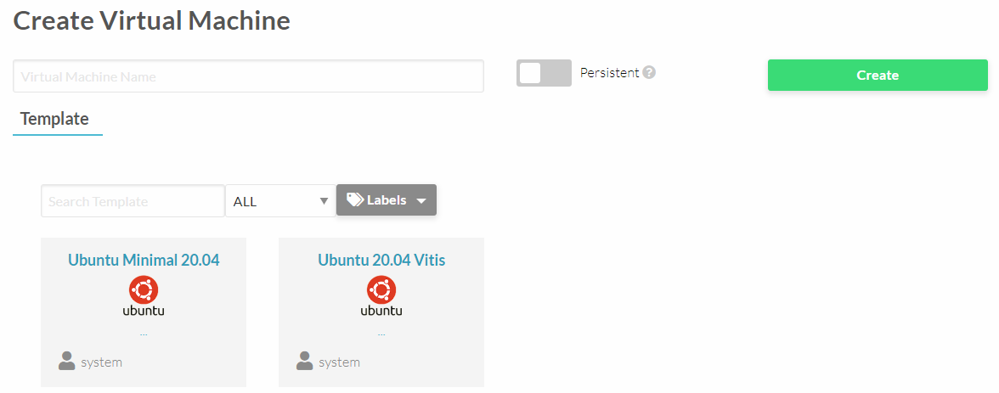

You can modify the *Capacity* tab to allocate computing resources as needed. 
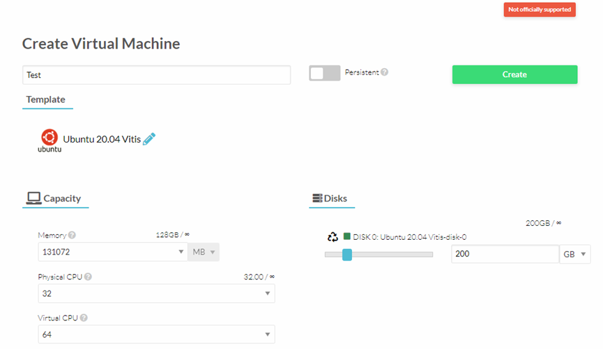

Once the virtual machine has been successfully deployed, you can find its IP address. 
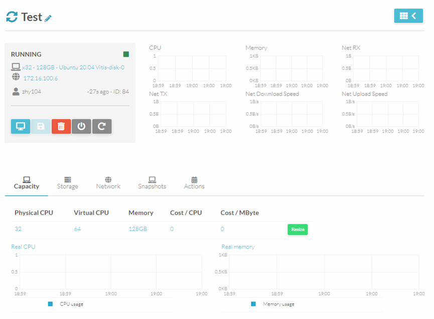

To connect this virtual machine, you can add the following configurations to your ssh config file (~/.ssh/config). Then, you should be able to connect to the VM using **ssh Test_Server**. By default, the **username** of the VM is **arclab** and the **password** is **123456**. *(please contact us if you cannot login to your VM)*
```bash
Host arcserver-jump
    HostName res.arc-lab.work
    Port 6222
    User zhuoping  [change to your username]

Host Test_Server
    HostName 172.16.100.6  [change to your VM's IP]
    User arclab
    ProxyCommand ssh -W %h:%p arcserver-jump
```
We have installed Vitis 2021.1, 2021.2, and 2023.1. Please feel free to contact us, if you want to use other versions of Vitis. We also have installed three packages for u250, u55c, and vck190. If you want to use other versions, please install by yourself.
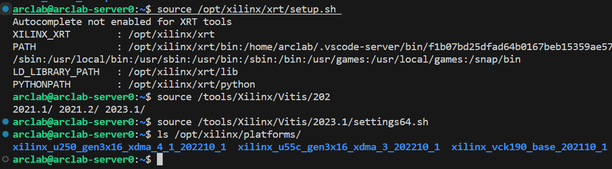

Currently, our server cannot access the public network directly, but we provide a proxy server (**socks5://172.16.100.4:4321**). To check if the proxy server is working, you can use the following commands:
```bash
export all_proxy=socks5://172.16.100.4:4321
curl ipinfo.io
```
If it works, you can see the data from [ipinfo.io](https://ipinfo.io/)
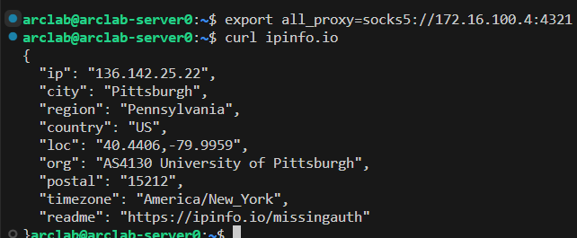

This proxy server can be used for **apt** as well:
```bash
sudo apt install xxx --option Acquire::HTTP::Proxy=http://172.16.100.4:4321
```
---
### Xilinx Versal VCK190
**Temporarily unavailable**
Currently, our vck190 is connected to a Raspberry Pi and we use serial port and ethernet to access the board.
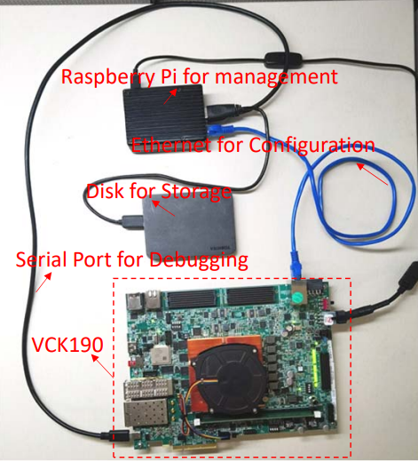

Similar to the CPU server, you can add the following to the ssh config file. Note that, you do not have to specify the Port in the jump this case.
```bash
Host pi-jump
    HostName res.arc-lab.work
    User zhuoping  [change to your username]
Host arc-pi
    HostName 10.10.1.10
    User zhuoping  [change to your username]
    ProxyCommand ssh -W %h:%p pi-jump
```

We mount a 1T disk to **/share** on the Raspberry Pi, and you can temporarily store your bitstream to **/share/[your username]**. 

Before uploading any bitstream to vck190, please try to open the serial port first. 
```bash
picocom -b 115200 /dev/ttyUSB1
```
You cannot open the serial port if someone else is using the port.
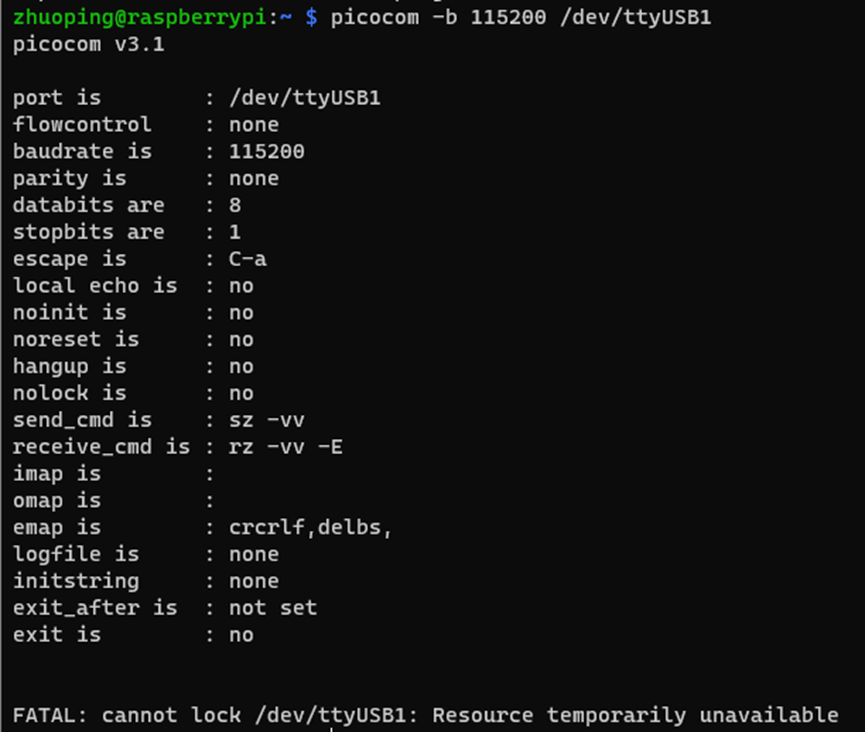
If you have waited for a long time, you can find who is using the port and contact us.
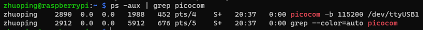

#### Run your bitstream on VCK190
After you successfully open the serial port, you can clean the previous bitstream in **/mnt/sd-mmcblk0p1** on VCK190 by typing in picocom: 
```bash
cls # you can use this in any path, it will clean the bitstream and cd to /mnt/sd-mmcblk0p1 
```

***Please do not delete BOOT001.BIN in /mnt/sd-mmcblk0p1***

Then, you can copy your binaries to /mnt/sd-mmcblk0p1 from the Raspberry Pi.
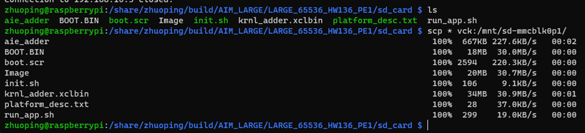
```bash
ssh * root@192.168.10.3:/mnt/sd-mmcblk0p1/ # passwd: root
```

After the copy is finished, reboot VCK190 and check the MULTIBOOT value in the boot log. It should be 0xF0000000, otherwise, the copy process may have failed and please contact us to fix it.
```bash
root@versal-rootfs-common-2021_1:/mnt/sd-mmcblk0p1# reboot
```
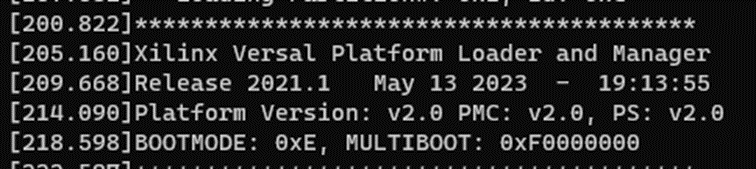

#### If everything is ok, you can test your bitstream on VCK190. Please **leave your binaries on VCK190** and **close the serial port** after using it. (using **ctrl+a+x** to exit picocom)
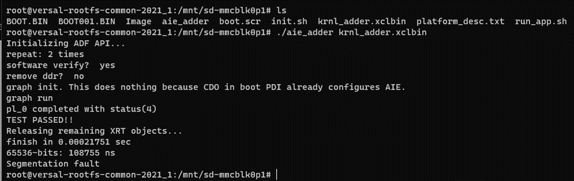
---

### Please feel free to contact us if you encounter any issues using our server. 
